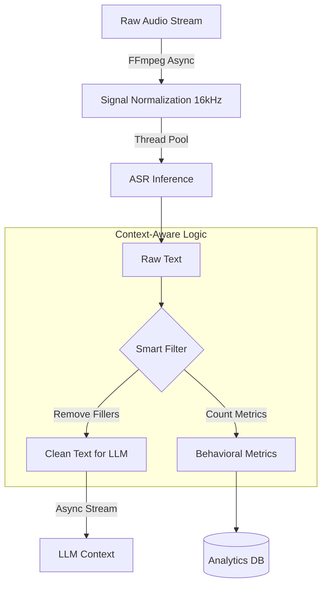

# SoftSkill AI: Production-Grade Social Simulation Pipeline


## Overview
**SoftSkill AI** is an advanced AI-powered social skills training platform designed specifically for individuals with **High-Functioning Autism Spectrum Disorder (HFASD)**. By utilizing real-time AI agents, the platform provides a safe, repeatable environment for users to practice complex social interactions, professional interviews, and daily conversational nuances.

The system focuses on reducing social anxiety through **Video Modeling + Immediate Feedback**, providing users with quantitative data on their performance during simulated interactions.

---

## 🚀 Engineering Architecture

The platform's core is built on a high-performance **AsyncIO Event-Driven Pipeline**. Unlike traditional synchronous pipelines, SoftSkill AI ensures zero-block concurrency, allowing for ultra-low latency during real-time speech-to-text (STT) and large language model (LLM) inference.

### Data Flow Pipeline
The following diagram illustrates the lifecycle of a single user interaction, from raw audio ingestion to behavioral metric persistence.



### Architectural Key Pillars:
*   **Non-Blocking I/O:** Every stage of the pipeline—from FFmpeg subprocesses to Ollama API calls—utilizes Python's `asyncio` framework. This prevents "Event Loop Starvation" and ensures high throughput.
*   **Hybrid Concurrency:** The system intelligently splits workloads:
    *   **I/O Bound (Networking/Subprocesses):** Handled via `async/await` and `AsyncOpenAI`.
    *   **CPU Bound (Inference):** Whisper inference is offloaded to managed thread pools using `asyncio.to_thread` to maintain UI responsiveness.

---

## Key Features

### 1. Low-Latency Pipeline
Integrated **FFmpeg Normalization** enforces a strict 16kHz Mono WAV standard before audio reaches the Perception Model. This reduces Whisper's internal resampling overhead and ensures deterministic transcription quality.

### 2. Context-Aware Cleaning ("Smart Like")
A proprietary preprocessing engine that distinguishes between:
*   **Verbs:** "I **like** pizza" (Preserved for semantic integrity).
*   **Fillers:** "It was, **like**, huge" (Extracted for metrics, stripped from LLM context).

### 3. Real-Time Feedback (SSE)
Utilizes **Server-Sent Events (SSE)** to stream AI responses token-by-token. This mimics natural human speech patterns and reduces perceived latency for the end-user.

### 4. Psychological & Behavioral Metrics
The system autonomously extracts clinical-grade metrics for social skill assessment:
*   **Filler Word Frequency:** Tracking 'um', 'uh', and contextual 'like'.
*   **Speech Rate (WPM):** Measuring conversational pacing.
*   **Sentiment Analysis:** Evaluating the emotional valence of the user's response.
*   **Response Latency:** Analyzing cognitive processing time.

---

## Tech Stack

*   **Core Backend:** Python 3.11, FastAPI, Pydantic v2.
*   **AI/ML Core:** Faster-Whisper (ASR), LLaMA 3.2 via Ollama (LLM), gTTS (TTS).
*   **DSP:** FFmpeg (Subprocess Stream Processing).
*   **Frontend:** Next.js 14, React, Tailwind CSS, MediaPipe (Planned).
*   **Infrastructure:** Docker Compose, PostgreSQL 16.

---

## Installation & Usage

### Prerequisites
*   Docker & Docker Compose.
*   NVIDIA GPU (Optional, for accelerated inference).

### Quick Start
1.  **Clone the Repository:**
    ```bash
    git clone https://github.com/YourRepo/SoftSkill-v2.git
    cd SoftSkill-v2
    ```

2.  **Environment Setup:**
    Create a `.env` file in the root directory (refer to `.env.example`).

3.  **Launch the Pipeline:**
    ```bash
    docker-compose up --build
    ```

The services will be available at:
*   **Frontend:** `http://localhost:3000`
*   **AI Service:** `http://localhost:8000`
*   **Backend API:** `http://localhost:5001`
