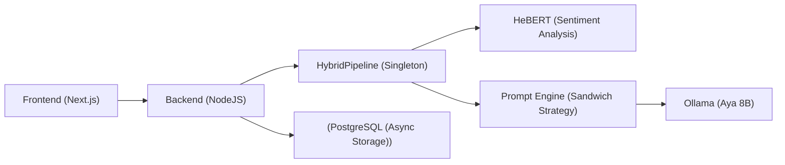

# SoftSkill AI Simulator
*A Next-Gen Role-Play Training Platform powered by Hybrid LLM Architecture.*

## Project Overview
SoftSkill AI Simulator is a deep technical platform for simulating difficult human interactions (customer service, negotiation, conflict resolution) using a local LLM (`aya:8b`) and real-time emotional intelligence (`HeBERT`). The system delivers guided role-play, sentiment-aware responses, and analytics-rich session history to help users practice high-stakes conversations in a safe, repeatable environment.

## Architecture Diagram


## The Brain: Detailed AI Logic
### The Sandwich Strategy
The prompt builder enforces behavior and safety without breaking character by layering instructions in a strict order:
- Layer 1: Static system rules (language, response length, role adherence).
- Layer 2: Dynamic persona (scenario-driven behavior, tone, and goals).
- Layer 3: Safety guardrails + sentiment injection (de-escalation when the user is stressed or hostile, block impossible content).

### HeBERT Integration
Before the LLM sees any message, HeBERT scores the user input for sentiment. That label is injected into the prompt so the response tone adapts in real time (e.g., negative sentiment triggers calming, directive behavior or strictness depending on difficulty).

## Tech Stack
- Frontend: Next.js 14, TailwindCSS, Lucide React, Recharts.
- Backend: Python 3.11, FastAPI, SQLModel (SQLAlchemy), async/await.
- AI/ML: Ollama (local inference), Hugging Face Transformers (HeBERT).
- Infra: Docker Compose, NVIDIA Container Toolkit (CUDA support).

## Features
- Real-time streaming (SSE) for low-latency conversational flow.
- Live analytics dashboard with sentiment trends and global session stats.
- Master-detail session history with per-message sentiment badges.

## Bank Loan FSM (Dana)
The bank scenario is deterministic and FSM-driven. The analyzer in `ai_service/app/engine/bank/` extracts slots (amount, purpose, income, confirmation, id details) and emits discrete signals (rude/refusal/repay, relevance/clarity/appropriateness). The FSM applies slot-skip rules to jump ahead when data is provided early and enforces a two-strike policy for rude language, refusal to provide info, or refusal to repay. The LLM only renders the final response based on the FSM decision object and never changes state.

State flow: `start → ask_amount → ask_purpose → check_income → sign_confirm → goodbye` (or `terminate` on strike rules).

## Installation
### Prerequisites
- Docker + Docker Compose.
- Optional: NVIDIA GPU with CUDA + NVIDIA Container Toolkit for accelerated inference.

### Run the Stack
```bash
docker compose up --build
```

### Service Ports
- Frontend: http://localhost:3000
- AI Service: http://localhost:8000
- Backend API: http://localhost:5001
