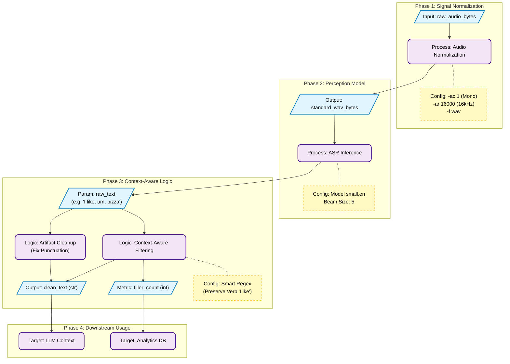

```mermaid
    flowchart TD
    %% --- הגדרת צבעים ועיצוב (מקצועי אקדמי) ---
    classDef process fill:#f3e5f5,stroke:#4a148c,stroke-width:2px,rx:10,ry:10,color:#000;
    classDef data fill:#e1f5fe,stroke:#0277bd,stroke-width:2px,color:#000;
    classDef config fill:#fff9c4,stroke:#fbc02d,stroke-width:1px,stroke-dasharray: 5 5,color:#000;

    %% --- Phase 1: Signal Normalization ---
    subgraph Phase1 ["Phase 1: Signal Normalization"]
        direction TB
        Input_Data[/"Input: raw_audio_bytes"/]:::data
        Proc_FFmpeg["Process: Audio Normalization"]:::process
        Conf_FFmpeg["Config: -ac 1 (Mono)<br/>-ar 16000 (16kHz)<br/>-f wav"]:::config

        Input_Data --> Proc_FFmpeg
        Proc_FFmpeg -.- Conf_FFmpeg
    end

    WAV_Data[/"Output: standard_wav_bytes"/]:::data
    Proc_FFmpeg --> WAV_Data

    %% --- Phase 2: Perception Model ---
    subgraph Phase2 ["Phase 2: Perception Model"]
        direction TB
        Proc_Whisper["Process: ASR Inference"]:::process
        Conf_Whisper["Config: Model small.en<br/>Beam Size: 5"]:::config

        WAV_Data --> Proc_Whisper
        Proc_Whisper -.- Conf_Whisper
    end

    Raw_Text_Data[/"Param: raw_text<br/>(e.g. 'I like, um, pizza')"/]:::data
    Proc_Whisper --> Raw_Text_Data

    %% --- Phase 3: Text Preprocessing Logic (UPDATED) ---
    subgraph Phase3 ["Phase 3: Context-Aware Logic"]
        direction TB

        %% שלב 1: זיהוי חכם
        Logic_Smart["Logic: Context-Aware Filtering"]:::process
        Conf_Smart["Config: Smart Regex<br/>(Preserve Verb 'Like')"]:::config

        Raw_Text_Data --> Logic_Smart
        Logic_Smart -.- Conf_Smart

        %% תוצרים
        Metric_Param[/"Metric: filler_count (int)"/]:::data
        Clean_Param[/"Output: clean_text (str)"/]:::data

        Logic_Smart --> Metric_Param
        Logic_Smart --> Clean_Param

        %% שלב 2: ניקוי שאריות
        Logic_Artifacts["Logic: Artifact Cleanup<br/>(Fix Punctuation)"]:::process
        Raw_Text_Data --> Logic_Artifacts
        Logic_Artifacts --> Clean_Param
    end

    %% --- Phase 4: Output Targets ---
    subgraph Phase4 ["Phase 4: Downstream Usage"]
        Usage_LLM["Target: LLM Context"]:::process
        Usage_DB["Target: Analytics DB"]:::process
    end

    Clean_Param --> Usage_LLM
    Metric_Param --> Usage_DB
```
